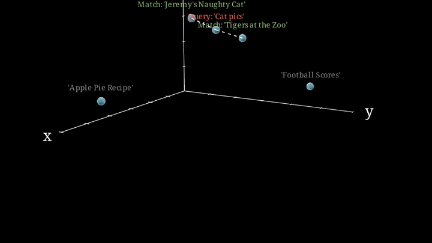

# 🎞️ GIFZA


<p align="center">
  <b>Semantic search for your memes, stickers, GIFs, and reaction images.</b>
</p>

---

## Why?

Have you ever struggled to find that perfect sticker or GIF for a group chat? Or a selfie you took on a trip a few years ago? Well I have. That is why I built GIFZA.

GIFZA (GIF ZAH) is a local-first semantic search engine for visual assets. Upload an image, sticker, or GIF, annotate it naturally, and retrieve it later using meaning instead of exact filenames or manual tags.

Searches like:
- `"sad cat staring into space"`
- `"strict asian obama"`
- `"low quality shocked reaction image"`
- `"anime girl crying aggressively"`

...will retrieve semantically similar assets, even if those exact words were never used in the filename or tags.

---

## Features

- Local-first on-device inference
- Semantic image retrieval using vector embeddings
- Approximate nearest neighbour (ANN) search
- Natural language querying
- Shared embedding space between images and text
- Fast retrieval with ObjectBox vector search
- Offline-capable
- Native mobile inference with ExecuTorch
---

## Heres how it works
GIFZA uses Apple's **MobileCLIP-S1** model, split into separate image and text encoders. Both encoders project their inputs into a shared embedding space, enabling natural language queries to retrieve visually and semantically related assets.

**Search Flow:**
1. User enters a query (e.g., `"confused cat at 3am"`)
2. Text encoder converts query into an embedding vector
3. ObjectBox runs ANN similarity search against stored image embeddings
4. Nearest matching assets are returned instantly

---

## Architecture

<p align="center">
  
</p>

```text
                ┌──────────────────┐
                │  Image / GIF     │
                └────────┬─────────┘
                         │
                         ▼
                ┌──────────────────┐
                │ MobileCLIP Image │
                │     Encoder      │
                └────────┬─────────┘
                         │
                  Image Embedding
                         │
                         ▼
                ┌──────────────────┐
                │    ObjectBox     │
                │  Vector Storage  │
                └────────┬─────────┘
                         ▲
                  ANN Search
                         │
                Query Embedding
                         │
                ┌────────┴─────────┐
                │ MobileCLIP Text  │
                │     Encoder      │
                └──────────────────┘

```

## Technical Details

### Embeddings & Cross-Modal Retrieval

Both image and text modalities exist in the same latent vector space. This enables zero-shot cross-modal retrieval without requiring paired training data at inference time.


Vector Storage & Retrieval
Embeddings are stored in ObjectBox as key-value pairs alongside asset metadata. On search, the query text is embedded, and ObjectBox performs native ANN similarity search to return the closest image vectors.

Heres a pretty good visualization I made with Manim



### On-Device Inference

All inference runs locally. Both MobileCLIP encoders were converted from PyTorch to ExecuTorch (.pte) format for mobile execution. This enables:

- Fully offline retrieval
- Low-latency inference
- Private, local asset indexing
- Zero external API dependencies

But converting to Executorch also brought about a problem, tokenization! before generating text embeddings, we need to first tokenize + pad the query(or annotation), but we could not trace the tokenizer and pack it into .pte convert model, the solution to this was to download the models tokenizer.json and then use [the dart sentencepice package](https://pub.dev/packages/dart_sentencepiece_tokenizer) for BPE tokenization.


### Challenges
Some of the more interesting engineering hurdles included:

- Splitting MobileCLIP into separate, deployable encoders
- Achieving reasonable inference latency for the text encoder on mobile(still a challenge!!)
- Converting PyTorch models to ExecuTorch without losing accuracy
- Handling unsupported tokenizer tracing and implementing manual BPE
- Maintaining embedding consistency across image and text modalities
- Integrating ANN search smoothly with ObjectBox